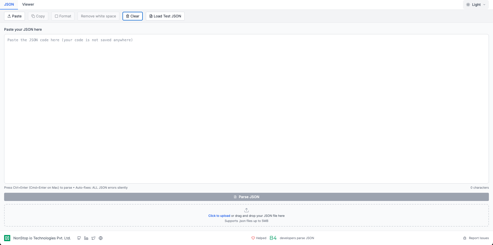

<div align="center">
  <a href="https://nonstopio.com">
    
  </a>
  <h1>JSON Viewer</h1>
  <p><em>Transform complex JSON data into beautiful, interactive visualizations</em></p>
  
  [](https://json.nonstopio.com)
  [](https://reactjs.org/)
  [](https://www.typescriptlang.org/)
  [](https://tailwindcss.com/)
  
  <p>
    <a href="https://nonstopio.com/about-us">About NonStop</a> •
    <a href="https://nonstopio.com">Our Website</a> •
    <a href="https://json.nonstopio.com">Try the App</a>
  </p>
</div>

---

## 🚀 **What is JSON Viewer?**

A modern, intuitive JSON viewer that transforms complex JSON data into a visually appealing, easily navigable interface. Perfect for developers, data analysts, and anyone working with JSON data.

## ✨ **Features**

### 🔧 **Core Functionality**

| Feature                       | Description                                                                                                |
| ----------------------------- | ---------------------------------------------------------------------------------------------------------- |
| 🧠 **Smart JSON Parsing**     | Real-time syntax validation with clear error messages                                                      |
| 🌳 **Interactive Tree View**  | Collapsible/expandable nodes with smooth animations                                                        |
| 🕸️ **Graph Visualizer**       | See JSON as an interactive node graph — pan, zoom, fit, rotate layout, collapse, search, and export as PNG |
| 📥 **Multiple Input Methods** | Paste, upload, or drag & drop JSON files                                                                   |
| 🔍 **Advanced Search**        | Global search with real-time highlighting and navigation                                                   |
| 🎨 **Theme Support**          | Dark/light/system theme with automatic detection                                                           |
| 📋 **Copy Functionality**     | Copy values and JSON paths with one click                                                                  |
| 🖥️ **Fullscreen Mode**        | Native browser fullscreen for immersive JSON viewing                                                       |

## 📸 **Screenshots**

<div align="center">
  
  
  <p>
    <a href="https://json.nonstopio.com">
      
    </a>
  </p>
</div>

---

## 🚀 **Getting Started**

### 📋 **Prerequisites**

- 📦 Node.js 16+
- 🔧 npm or yarn

### ⚡ **Quick Start**

```bash
# 1️⃣ Clone the repository
git clone <repository-url>
cd json-viewer

# 2️⃣ Install dependencies
npm install

# 3️⃣ Start development server
npm run dev
```

### 🏗️ **Build for Production**

```bash
# Build the application
npm run build

# Preview the build
npm run preview
```

### 🌐 **Live at**

Visit our hosted version at **[json.nonstopio.com](https://json.nonstopio.com)** to try it out instantly!

## 📖 **How to Use**

<div align="center">

| Step | Action         | Description                                                             |
| ---- | -------------- | ----------------------------------------------------------------------- |
| 1️⃣   | **Input JSON** | Paste JSON directly, upload a .json file, or drag & drop                |
| 2️⃣   | **Explore**    | Click to expand/collapse nodes, use search to find specific keys/values |
| 3️⃣   | **Visualize**  | Open the Visualizer tab to see JSON as an interactive node graph        |
| 4️⃣   | **Fullscreen** | Click the maximize button for immersive viewing experience              |
| 5️⃣   | **Copy**       | Hover over nodes to copy values or JSON paths                           |
| 6️⃣   | **Customize**  | Toggle between light/dark themes or use system preference               |

</div>

### ⌨️ **Keyboard Shortcuts**

| Shortcut                   | Action                         |
| -------------------------- | ------------------------------ |
| `Ctrl+Enter` / `Cmd+Enter` | Parse JSON                     |
| `Ctrl+F` / `Cmd+F`         | Open search                    |
| `Enter`                    | Next search result             |
| `Shift+Enter`              | Previous search result         |
| `Escape`                   | Clear search / Exit fullscreen |

## 🛠️ **Technology Stack**

<div align="center">

| Category          | Technology                                                 |
| ----------------- | ---------------------------------------------------------- |
| 🎨 **Frontend**   | React 18 + TypeScript                                      |
| 💄 **Styling**    | Tailwind CSS with custom components                        |
| 🎭 **Icons**      | Lucide React                                               |
| ⚡ **Build Tool** | Vite                                                       |
| 🚀 **Deployment** | Hosted at [json.nonstopio.com](https://json.nonstopio.com) |

</div>

## 🏗️ **Architecture**

```
📦 src/
├── 🧩 components/          # React components
├── 🪝 hooks/              # Custom React hooks
├── 📝 types/              # TypeScript type definitions
├── 🔧 utils/              # Utility functions and services
└── 🎯 App.tsx             # Main application component
```

## 🤝 **Contributing**

We welcome contributions! Here's how to get started:

| Step | Command                                   | Description                   |
| ---- | ----------------------------------------- | ----------------------------- |
| 1️⃣   | `Fork`                                    | Fork the repository on GitHub |
| 2️⃣   | `git checkout -b feature/amazing-feature` | Create a feature branch       |
| 3️⃣   | `git commit -m 'Add amazing feature'`     | Commit your changes           |
| 4️⃣   | `git push origin feature/amazing-feature` | Push to the branch            |
| 5️⃣   | `Open PR`                                 | Open a Pull Request           |

---

<div align="center">
  <h3>Made with ❤️ by NonStop Team</h3>

  <p>
    
  </p>
</div>
